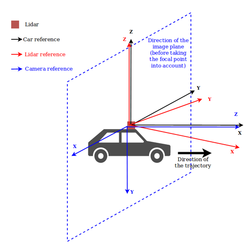
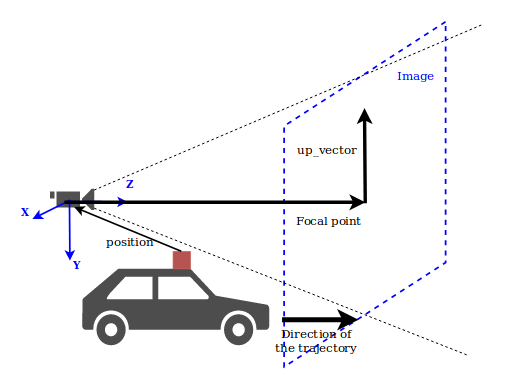
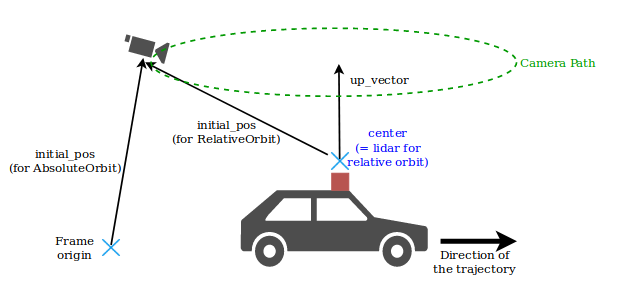
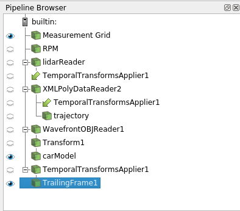
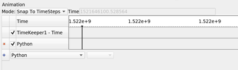
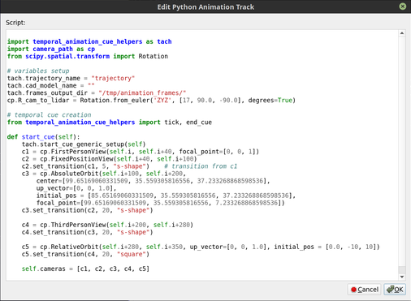

# Animations in Python

With Python scripting and Paraview animation mechanisms, there are many ways to animate a scene in LidarView.

This document aims at describing how to easily generate LidarView animations with Python.

- **temporal animations** are Paraview-based animations that depend on the data flow :
  they increment the pipeline time at each step. They often require providing a
  trajectory input which is used to move the camera reference at each step.
  The script **example_temporal_animation.py** provides an exemple of how to use it.

- **non-temporal animations** are simpler animations, moving the camera but not
  updating the pipeline time nor using Paraview animation mechanism. The camera
  can only move in a "frozen" version of the data.
  This kind of animation works on both data with and without timesteps.
  The script **example_non_temporal_animation.py** provides an example of how to use it.

This README file focuses on **temporal animations**.
Non-temporal animations make use of the same *CameraPaths* objects but require less work
(hence understanding how temporal animations work should make it easy to use non-temporal ones).

Check out the `examples` directory for samples scripts to illustrate animations use.

For more information on how to use Python scripting and animations in Paraview,
see [here](https://trac.version.fz-juelich.de/vis/wiki/Examples/ParaviewAnimating).

- [Animations in Python](#animations-in-python)
  - [Requirements](#requirements)
  - [Relevant modules](#relevant-modules)
    - [`lib/camera_path.py`](#libcamera_pathpy)
    - [`lib/temporal_animation_cue_helpers.py`](#libtemporal_animation_cue_helperspy)
  - [Tutorial](#tutorial)
    - [How to define an animation cue script with `temporal_animation_cue_helpers`](#how-to-define-an-animation-cue-script-with-temporal_animation_cue_helpers)
      - [Function `start_cue_generic_setup`](#function-start_cue_generic_setup)
      - [Function `tick`](#function-tick)
      - [Function `end_cue`](#function-end_cue)
      - [Writing custom `start_cue` / `tick` / `end_cue` functions](#writing-custom-start_cue-tick-end_cue-functions)
      - [Example](#example)
    - [How to set the parameters (position, up_vector, focal_point, ...) for the different camera paths](#how-to-set-the-parameters-position-up_vector-focal_point-for-the-different-camera-paths)
      - [How to set `R_cam_to_lidar`](#how-to-set-r_cam_to_lidar)
      - [How to set the camera path parameters](#how-to-set-the-camera-path-parameters)
    - [Tips](#tips)
      - [How to generate a pseudo first person view from the top of a car model:](#how-to-generate-a-pseudo-first-person-view-from-the-top-of-a-car-model)
      - [How to add, scale and center a 3D car model:](#how-to-add-scale-and-center-a-3d-car-model)
  - [How to add `PythonAnimationCue` script to lidarview animations](#how-to-add-pythonanimationcue-script-to-lidarview-animations)
    - [Using a python script](#using-a-python-script)
      - [Define a Lidarview processing pipeline](#define-a-lidarview-processing-pipeline)
      - [Make sure the trajectory and the data have a similar time base](#make-sure-the-trajectory-and-the-data-have-a-similar-time-base)
      - [Select what you want to show in the animation](#select-what-you-want-to-show-in-the-animation)
      - [Set up the animation](#set-up-the-animation)
      - [Play the animation](#play-the-animation)
    - [Using lidarview GUI](#using-lidarview-gui)

## Requirements

In order to use temporal animations helpers, (ie. for camera paths depending on a trajectory),
`scipy` and `numpy` must be installed on the python used by LidarView.
(run `pip install scipy numpy` on Linux or Osx)

## Relevant modules

### `lib/camera_path.py`

This module contains the classes which define basic camera paths.
Currently, the following types of camera are implemented:
  - **absolute camera path**: views that are defined in the scene reference:
    - *fixed position view*: the scene is viewed from a constant point in the scene reference,
      fixed compared to the background,
    - *absolute orbit*: the scene is viewed following an orbit around a point of the scene reference.
  - **relative camera path**: views that are defined in the car/lidar reference:
    - *first person view*: the scene is viewed from the vehicle (ie. the current point in the trajectory).
    - *third person view*: the scene is viewed from a constant point relative to the vehicle (ie. to the trajectory).
    - *relative orbit*: the scene is viewed following an orbit around the vehicle in its reference
      (ie. around the current point of the trajectory).

### `lib/temporal_animation_cue_helpers.py`

This module contains helper functions in order to easily create temporal animation
scripts with `smp.PythonAnimationCue()`, which needs to define the following 3 functions:

```python
def start_cue(self):
    """Function called at the beginning of the animation """
    ...

def tick(self):
    """Function called at each time step of the animation """
    ...

def end_cue(self):
    """Function called at the end of the animation """
    ...
```

The `smp.PythonAnimationCue()` object requires this python script to be manually copy/pasted
to the LidarView interface or provided as its `animation.Script` property (as a string).

Check [this doc](https://trac.version.fz-juelich.de/vis/wiki/Examples/ParaviewAnimating) for reference

This module provides tools to help defining such methods in the case of temporal
data following a trajectory (see documentation in that file for more details).

--------------------------------------------------------------------------------

## Tutorial

The following provides steps to use **temporal_animation_cue_helpers.py** and
**camera_path.py** to add a temporal animation to LidarView.
This will require a python script to be manually copy/pasted to the lidarview
interface or provided as a string property to a `smp.PythonAnimationCue()` object.

### How to define an animation cue script with `temporal_animation_cue_helpers`

An animation cue script is meant to be provided to a `PythonAnimationCue`.
The usage of `PythonAnimationCue` is explained further down in this file.

**temporal_animation_cue_helpers** provides some helpers functions in order to generate
`start_cue` / `tick` / `end_cue` for temporal data with a trajectory using minimal code:
- `start_cue_generic_setup()`
- `tick()`
- `end_cue()`

This module comes with pre-configured global parameters.
However, some of these parameters can/must be overridden to correspond to your actual setup:
- `trajectory_name`: the name of the element of the pipeline that serves for trajectory.
  For each pose, it must have an orientation array (default name is `Orientation(AxisAngle)`),
  as well as a timestamp in seconds (default name is `Time`).
- `frames_output_dir` (optional): directory where you save the output screenshots.
- `cad_model_name` (optional): the name of the element of the pipeline that serves
  for the 3D model to place at the current trajectory point for each frame.

Please have a look to other parameters directly at the begining of [lib/temporal_animation_cue_helpers.py](LVCore/Utilities/Animation/lib/temporal_animation_cue_helpers.py) for enhanced usage.

#### Function `start_cue_generic_setup`

This method runs generic setup steps at cue start.
It is intended to be run inside a `start_cue` before the camera definition step.

The different steps it runs are:
- getting the trajectory
- (optional) getting a 3D model (for example a car model to add to the frame display)
- initializing camera path

The only setup left to do is the camera path, which can be composed of:
- `CameraPath` objects (`FirstPersonView`, `ThirdPersonView`, ...).
  See below for hints on how to set their parameters.
- Transitions between those objects following this model:

```python
current_camera.set_transition(former_camera, interpolation_type)
# interpolation type can be: linear, square, s-shape
```

Example:

```python
import temporal_animation_cue_helpers as tach
import camera_path as cp

def start_cue(self)
    tach.start_cue_generic_setup(self)
    c1 = cp.ThirdPersonView(...)
    c2 = cp.FistPersonView(...)
    c2.set_transition(c1, 's-shape')
    self.cameras = [c1, c2]
```

#### Function `tick`

This method runs the following steps at each timestep:
- compute the trajectory pose index corresponding to the current animation time
- extract the pose from the trajectory at this index
- update camera and move 3D model using updated pose
- update render view
- save screenshot

If you want to use standard behavior (moving the camera path based on a trajectory
with synchronized timestamps), you can directly import this function.
To specialize the behavior of this function (screenshots resolution, names, etc.),
you can modify the module parameters to your needs.

Example:

```python
import temporal_animation_cue_helpers as tach

# Use a different time array with a timeshift compared to view time
tach.params['trajectory_time_array'] = "timestamp"
tach.params['trajectory_to_animation_time_offset'] = 1521646061.19

# Change snapshots saving options
tach.params['frames_output_dir'] = "/path/to/images/"
tach.params['image_resolution'] = (3840, 2160)

from temporal_animation_cue_helpers import tick
```

#### Function `end_cue`

This method prints that the animation is finished.
If required, it can also generate a video using snapshots saved during the animation.

Similarly to `tick`, it can be used directly with an import.

Example:

```python
import temporal_animation_cue_helpers as tach

tach.params['video_output_path'] = "/path/to/my/video.mp4"  # Name of the video generated using snapshots
tach.params['video_framerate'] = 20.  # Output video frame rate [fps]

from temporal_animation_cue_helpers import end_cue
```

#### Writing custom `start_cue` / `tick` / `end_cue` functions

As the proposed default `start_cue_generic_setup`, `tick` or `end_cue` implementations
may not fit your needs, you may need to write custom behaviors for them.
To help you in this task, generic helpers are already available, updating camera,
saving screenshot, generating video...

#### Example

Here is an example of a full `PythonAnimationCue` script.
See **example_temporal_animation.py** for an example in context.

```python
from scipy.spatial.transform import Rotation
import temporal_animation_cue_helpers as tach
import camera_path as cp

# modules parameters setup
tach.params['cad_model_name'] = "your-model"
tach.params['trajectory_name'] = "your-trajectory"
tach.params['frames_output_dir'] = "/your/ouptut/dir"

cp.R_cam_to_lidar = Rotation.from_euler("XYZ", [0, 90, -90],degrees=True)

def start_cue(self):
    tach.start_cue_generic_setup(self)
    c1 = cp.FirstPersonView(...)
    c2 = cp.FixedPositionView(...)
    c2.set_transition(c1, 5, "s-shape")
    self.cameras = [c1, c2]

from temporal_animation_cue_helpers import tick, end_cue
```

### How to set the parameters (position, up_vector, focal_point, ...) for the different camera paths

First of all, ensure to correctly set the module parameter `R_cam_to_lidar`,
representing the rotation between the lidar reference and the camera reference
(see below for more details on how to set it).

- `AbsoluteOrbit` and `FixedPositionView` are camera paths that are not relative
  to the trajectory, hence they expect absolute parameters
  (with coordinates in the fix reference of the view).

- `ThirdPersonView`, `FirstPersonView` and `RelativeOrbit` expect coordinates that
  are relative to the trajectory, so they expect coordinates in the camera reference
  (ie. the reference of the current lidar frame, rotated by R_cam_to_lidar)

#### How to set `R_cam_to_lidar`

`R_cam_to_lidar` is the rotation between the camera frame and the lidar frame.
It is common to have X, Y forming the image plane, and Z pointing in the field of view of the image.

Example:

In the following case (from dataset-la-doua), the Z axis of the lidar is vertical,
but X doesn't point to the front of the car, `R_car_to_lidar` should be set to something like:

```python
cp.R_cam_to_lidar = Rotation.from_euler('ZYZ', [17, 90.0, -90.0], degrees=True)
```

Which is composed of:
- a rotation of 17 deg around Z to compensate for the lidar-trajectory angle
- a rotation of [0, 90.0, -90.0] to pass from Z in the front (camera ref) to X in the front (lidar ref)




#### How to set the camera path parameters

- `position`: position of the camera, either
    - in the frame reference for absolute camera paths
    - in the camera reference, with the lidar position as origin for relative camera paths
- `focal point`: focal point of the camera in the camera reference (where the camera is pointing to)
- `up vector`: direction of the top of the image.



Specific to orbits:
- `initial_pos`: initial position of the camera (similar to `position`)
- `up_vector`: rotation axis
- `center`: center of rotation
- `ccw`: boolan, decides the direction direction (counter-clock-wise by default)



Specific to *FixedPositionView*:
- `position` is by default to `None`, in which case it takes the current position
- `focal_point` is by default to `None`, in which case it uses the lidar position


### Tips

#### How to generate a pseudo first person view from the top of a car model:

```python
c1 = cp.ThirdPersonView(0, 50, focal_point=[0, 0, 20], position=[0, -1.7, -3.5])
```

This enables being slightly behind and on top of the car and see the front of it in the view.

#### How to add, scale and center a 3D car model:

(the values for this example are valid for dataset-la-doua)

- Add a cad model reader
- Add a transform to make the model look forward in the lidar reference
- Add a second transform to let the camera_animation_cue move the car with the trajectory.

Example:

```python
carModelPath = '/path/to/your/3D/models/small-red_pickup.obj'
carModelScale = [0.05, 0.05, 0.05]
carModelTranslation = [0, 0, -1.5]  # this lets the car lie on the floor
carModelRotation = [90, 90 + 17, 0]
# [90, 90, 0] to compensate the model orientation
# + [0, 17, 0] to compensate the lidar orientation to the front of the car

if not carModelPath:
    carModel = None
else:
    carModelSource = WavefrontOBJReader(FileName=carModelPath)
    # Scale and center the model
    carModelTmp = smp.Transform(Input=carModelSource)
    carModelTmp.Transform.Scale = carModelScale
    carModelTmp.Transform.Translate = carModelTranslation
    carModelTmp.Transform.Rotate = carModelRotation

    # Add a transform to enable the script to move the car model
    carModel = smp.Transform(Input=carModelTmp)
    RenameSource('carModel', carModel)

tach.params['cad_model_name'] = "carModel"
```

## How to add `PythonAnimationCue` script to lidarview animations

### Using a python script

- Define a LidarView processing pipeline
- Make sure the trajectory and the data have a similar time base
- Select what you want to show in the animation
- Setup the animation
- Play the animation

#### Define a Lidarview processing pipeline

See `examples/` directory for various examples.

#### Make sure the trajectory and the data have a similar time base

To be able to find the correct pose from the trajectory matching with current
view/animation time, both timestamps must be expressed in the same time scale.

If this is not the case for your data, 2 possibilities: 

1. If both timestamps are using the same unit, but only differ from a fixed offset,
   set the `trajectory_to_animation_time_offset` parameter :

  ```python
  tach.params['trajectory_to_animation_time_offset'] = timeshift
  ```

2. Otherwise, you might need to update the trajectory with a Calculator :

  ```python
  # trajectoryReader has timestamps in µs
  correctedTraj = smp.PythonCalculator(
      Input=trajectoryReader,
      Expression='Time * 1e-6 + {}'.format(timeshift),
      ArrayName='Time')
  ```

***Tip***: The timeshift can be automatically computed using :
```python
# Compute time offset between view (data) and trajectory timesteps
view_timesteps = GetTimeKeeper().TimestepValues
trajectory_timesteps_bounds = trajectory.GetPointDataInformation().GetArray('Time').GetRange()
timeshift = view_timesteps[0] - trajectory_timesteps_bounds[0]
```

#### Select what you want to show in the animation

Example:

```python
# show data in view
dataDisplay = smp.Show(threshold1, renderView1)
trajectoryDisplay = smp.Show(correctedTraj, renderView1)

categoryLut = cmt.colormap_from_categories_config(categoriesConfigPath)
smp.ColorBy(dataDisplay, ('POINTS', 'category'))
```

#### Set up the animation

```python
# Create an animation cue with temporal_animation_cue_helpers
anim_cue = smp.PythonAnimationCue()
anim_cue.Script = """
from scipy.spatial.transform import Rotation
import temporal_animation_cue_helpers as tach
import camera_path as cp

# variables setup
tach.params['cad_model_name'] = "trajectory"
tach.params['trajectory_name'] = "carModel"
tach.params['frames_output_dir'] = "{frames_output_dir}"

cp.R_cam_to_lidar = Rotation.from_euler('ZYZ', [17, 90.0, -90.0], degrees=True)

# temporal cue creation
from temporal_animation_cue_helpers import tick, end_cue

def start_cue(self):
    tach.start_cue_generic_setup(self)

    idx0 = {animation_start_timestep}  # begin animation at given timestep

    c1 = cp.FirstPersonView(idx0, idx0 + 40, focal_point=[0, 0, 1])

    c2 = cp.FixedPositionView(idx0 + 40, idx0 + 100)
    c2.set_transition(c1, 5, "s-shape")		# transition from c1

    c3 = cp.AbsoluteOrbit(idx0 + 100, idx0 + 200,
            center=[99., 35., 37.],
	        up_vector=[0, 0, 1.0],
	        initial_pos = [85., 35., 37.],
	        focal_point=[99., 35., 7.])
    c3.set_transition(c2, 20, "s-shape")

    c4 = cp.ThirdPersonView(idx0 + 200, idx0 + 280)
    c4.set_transition(c3, 20, "s-shape")

    c5 = cp.RelativeOrbit(idx0 + 280, idx0 + 350,
            up_vector=[0, 0, 1.0],
            initial_pos = [0.0, -10, 10])
    c5.set_transition(c4, 20, "square")

    self.cameras = [c1, c2, c3, c4, c5]

""".format(animation_start_timestep=animationStartTimestep,
           frames_output_dir=framesOutDir)

# Set animation times
animation = smp.GetAnimationScene()
animation.Cues.append(anim_cue)
animation.PlayMode = 'Snap To TimeSteps'
timesteps = animation.TimeKeeper.TimestepValues
nFrames = len(timesteps)
animation.StartTime = timesteps[max(0, animationStartTimestep)]
animation.EndTime = timesteps[min(nFrames-1, animationEndTimestep)]
```

#### Play the animation

```python
# ---- Play the animation
animation.Play()
```

### Using lidarview GUI

- Define your pipeline in the `Pipeline Browser` pane.



- Open the `Animation` pane, choose the *Snap to timesteps* mode



- Add a `Python` animation by selecting it in the drop-down list under the table
  and clicking on `+`. This will open a pop-up window.
- Replace its content by the animation script.
- Press OK
- Run the animation with the `Play` button in the top bar


