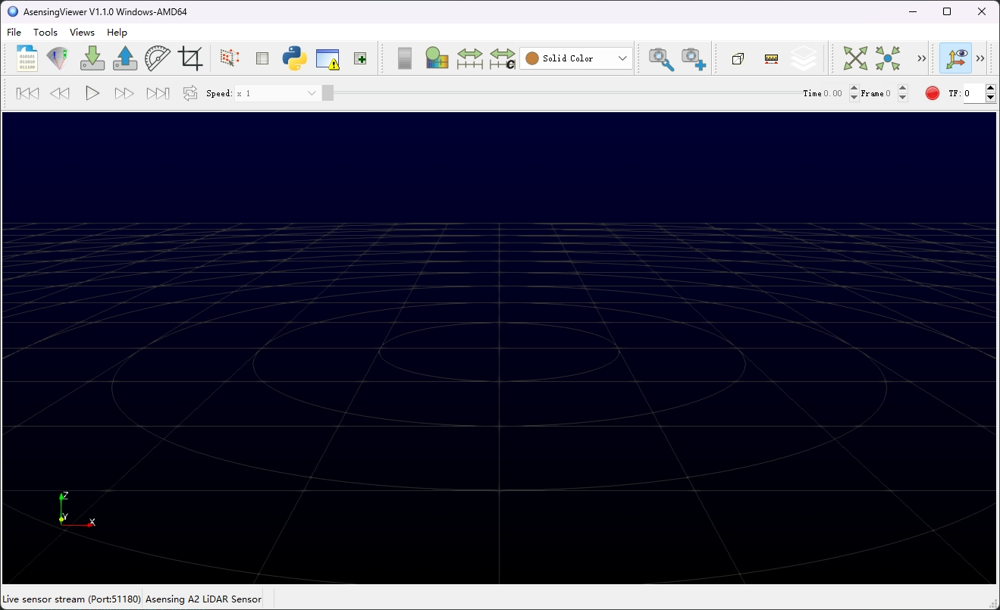

# AsensingViewer

AsensingViewer is a [LiDAR](https://www.asensing.com/technical/58) point cloud visualization software developed by Asensing Group based on [LidarView](https://gitlab.kitware.com/LidarView/lidarview). The picture below is a screenshot of the main user interface of AsensingViewer.

## Overview

AsensingViewer  supports two modes, online mode and playback mode. Online mode requires a connection to the LiDAR via Ethernet, and the playback mode requires importing a pre-recorded pcap file.

## Architecture

## How to build

See [Docs/BUILD.md](Docs/BUILD.md).

## Contact

- Maintenance: luhuadong@asensing.com

